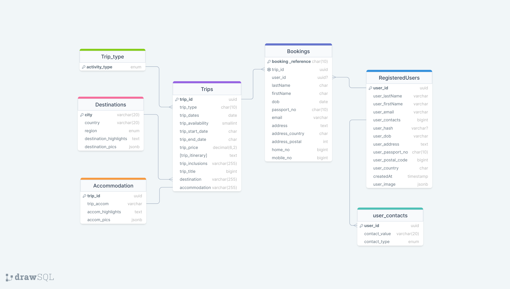

# Cloud Facilities

Cloud Facilities is an adventure travel booking app that aims to bring skydivers together by providing planned trips such that users can save on the hassle of planning for themselves.

This project is also highly experimental, using new (to me) technologies such as Next.js, Prisma ORM, Tailwind, Supabase, NextAuth and Nodemailer.

# Technologies/Platforms used

## Main Application

### <a href="https://nextjs.org/" target="_blank" >React.js with Javascript</a>

This app was built using Next.js App router, a Javascript framework built on React, to explore mainly its server-side rendering and how it would integrate both front and back-end work.

### <a href="https://tailwindcss.com/" target="_blank" >Tailwind CSS</a>

Tailwind CSS was utilized for ease of customization and use. Components from [TailwindUI's](https://tailwindui.com/) component library were also used for quick implementation

### <a href="https://www.prisma.io/" target="_blank" >Prisma ORM</a>

Prisma ORM was utilized to work with the database as it makes it more intuitive for database queries while providing a type-safe API for submitting them.

### <a href="https://www.postgresql.org/" target="_blank" >PostgreSQL</a>/<a href="https://supabase.com/" target="_blank" >Supabase</a>

Postgres is an SQL database that can be integrated with Prisma. An SQL database was chosen to explore its features and practice relational queries. (Post reflection: As Postgres' wide range of features would be underutilized, perhaps a more lightweight SQL DB might be more suitable.)

Supabase is an open-source platform for building modern, real-time applications with a serverless backend and was used to make it easier to work with Postgres.

## Authentication

### <a href="https://next-auth.js.org/" target="_blank" >NextAuth</a>

NextAuth/Auth.js was utilized as the main auth solution.

[bcrypt](https://www.npmjs.com/package/bcrypt) was used to hash passwords. [jsonwebtoken](https://www.npmjs.com/package/jsonwebtoken) was used to assign access & refresh tokens. A [Prisma Adapter](https://next-auth.js.org/v3/adapters/prisma) was also used to interface NextAuth with database.

## Email feature

### <a href="https://nodemailer.com/about/" target="_blank" >Nodemailer</a>

Nodemailer is a plug-and-play email sending solution for developers who want implement mock sending of emails. It also uses [Ethereal](https://ethereal.email/), a fake SMTP service.

### <a href="https://react.email/" target="_blank" >React-email</a>

React.email provides a collection of high-quality, unstyled components for creating beautiful emails using React and TypeScript (in this case, Javascript).

# Model

# General Approach

The features achieved in this app includes:

For all users:

<ol> 
    <li> Users can view all trips available
    <li> Users can view details of particular trip
    <li> User can book trip as guest (app should validate inputs) and receive (mock)email confirmation
    <li> A user cannot create duplicate bookings 
    <li> User can review booking using Booking Reference and Last Name
    <li> User can sign up and log-in
    <li> A booking/cancellation should adjust trip availability slots in trip details
</ol>

For registered users:

<ol>
    <li> Viewing of profile (contacts and bookings), protected against guests
    <li> Viewing of booking, from profile, does not require user to enter Booking Reference and Last Name
    <li> User information auto-populates for bookings
    <li> Cancelling of bookings (unable to cancel other users bookings)
</ol>

# To use

Install dependencies  `npm i`

Create .env file, in it you'll require

<ul>
    <li>DIRECT_URL - for Postgres database
    <li>DATABASE_URL - which is DIRECT_URL + '?pgbouncer=true'
    <li>NEXTAUTH_SECRET - random string
    <li>NEXTAUTH_URL - localhost and port
    <li>SECRET_KEY - secret key for jwt
    <li>ETH_PASSWORD - password for ethereal.email account
    <li>ETH_USER - user for ethereal.email account
</ul>

To migrate model into supabase 
`npx prisma migrate dev` 
You will be prompted to give it a name. This command will also automatically seed the data in the file 'seed.js'

# Possible future implementations

The idea behind this app is to bring together people for different adventure travel activities such as Diving and Snowboarding, as such, trips will expand to these different types as well. The database model is equipped to handle such additions

Implementation of Mock Payment System using Stripe

# Thanks for reading

This app is created by [Low Zi Ming](https://github.com/zimlow)
